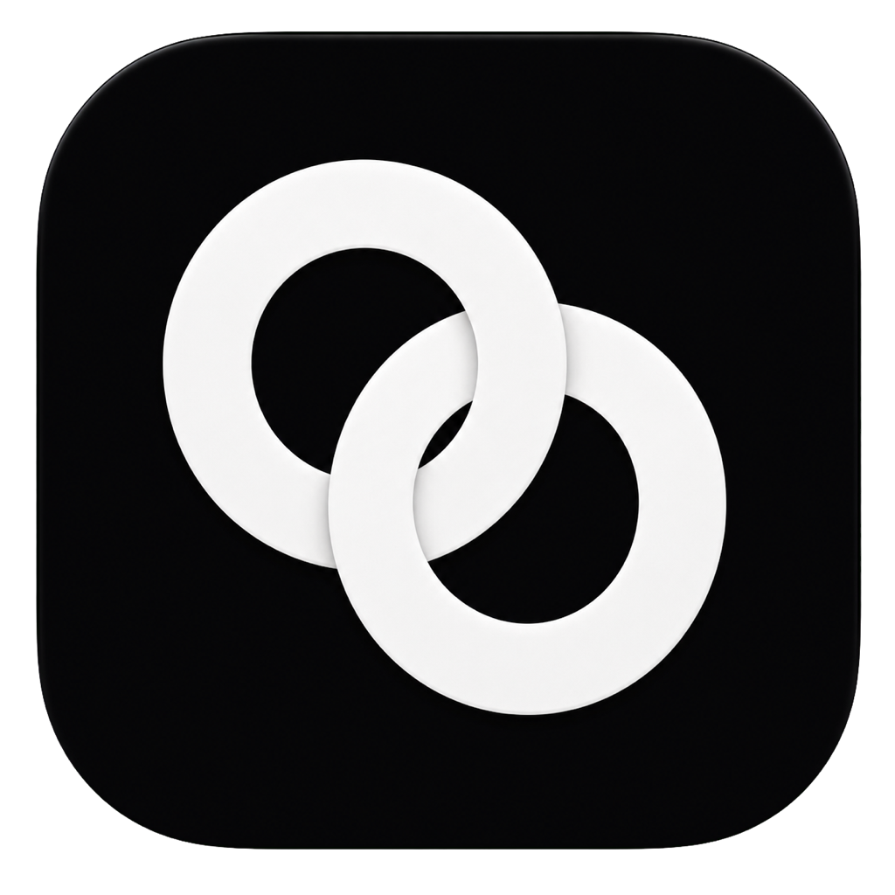

# Open GenOffice

> An independent fork of
> [GenOffice](https://github.com/genspark-ai/genoffice) that keeps Genspark
> available while adding first-class bring-your-own-provider support.

Open GenOffice is not affiliated with or endorsed by Mainfunc, Genspark,
Apache OpenOffice, or Microsoft. GenOffice and Genspark are trademarks of
Mainfunc, Inc.; other names belong to their respective owners.

An AI-native office suite for macOS and Windows: word processor, spreadsheet,
presentations, and PDF — five Electron apps sharing one engine layer, built
around AI editing as a first-class workflow rather than a bolted-on chat box.

## Download

Installable builds are published on the
[GitHub Releases page](https://github.com/sergedoub/open-genoffice/releases):

- macOS Apple silicon: signed and notarized DMG or ZIP
- Windows x64: NSIS installer

Intel Macs are not currently supported. Release assets include SHA-256
checksums. Developers can build the same source locally using the commands
below.

## What this fork changes

- Keeps Genspark as a built-in provider and migration default.
- Adds OpenRouter, Anthropic, and OpenAI with user-supplied API keys.
- Encrypts provider keys through Electron `safeStorage`; raw keys remain in the
  main process and never enter office documents.
- Adds one suite-wide default plus sticky per-document provider/model routes.
- Lets users change models between prompts without silently falling back to a
  different provider.
- Isolates the application identity and update channel from upstream builds.

See [MODIFICATIONS.md](MODIFICATIONS.md) for the derivative change record and
[docs/upstream-provenance.md](docs/upstream-provenance.md) for ancestry and
upstream maintenance.

## Upstream and acknowledgments

This project exists because Mainfunc released GenOffice under Apache-2.0. We
appreciate the substantial editor, file-format, rendering, and application work
they made available. See [ACKNOWLEDGMENTS.md](ACKNOWLEDGMENTS.md) for full
credit and links to the upstream project.

## Apps

| App           | Product                   | What it is                                                                                                                                                                                                                                                                                                                                                 |
| ------------- | ------------------------- | ---------------------------------------------------------------------------------------------------------------------------------------------------------------------------------------------------------------------------------------------------------------------------------------------------------------------------------------------------------- |
| `apps/docs`   | **Open GenOffice Docs**   | `.docx` word processor. Byte-preserving round trip: only dirty paragraphs are regenerated (paragraph patch), everything else in the original file is kept byte-for-byte, so opening and saving never breaks layout in Word. Paginated view whose line metrics reproduce the original document's layout, tracked changes, comments, styles, equations, ink. |
| `apps/sheets` | **Open GenOffice Sheets** | `.xlsx` spreadsheet. UI built on the open-source [Univer](https://github.com/dream-num/univer) core (Apache-2.0) with a large layer of in-house extensions; xlsx import/export runs through an in-house Rust sidecar (calamine + IronCalc), charts are rendered in-house (Konva), plus pivot tables, slicers, conditional formatting, and formula tracing. |
| `apps/slides` | **Open GenOffice Slides** | `.pptx` presentations. In-house pptx parse/render/edit engine with masters, charts, cropping, ink, and text shaping (HarfBuzz metrics).                                                                                                                                                                                                                    |
| `apps/pdf`    | **Open GenOffice PDF**    | PDF viewer/editor on pdf.js + pdf-lib: annotations, forms, outlines, stamps, signatures, page operations, print.                                                                                                                                                                                                                                           |
| `apps/shell`  | **Open GenOffice**        | The suite shell: home screen and tabbed hosting of the four editors. Auto-update is optional and disabled unless a derivative update feed is configured at packaging time.                                                                                                                                                                                 |

Every app embeds the same AI panel: block-granular AI editing with version
snapshots and diffs in docs, a tool-calling agent over workbook/slide/PDF
state in the others.

**AI providers.** Genspark remains available through its account sign-in. The
derivative also supports device-local OpenRouter, Anthropic, and OpenAI keys,
with a suite default and sticky per-document provider/model routes. Bring-your-
own keys are encrypted in the Electron main process and are not exposed to
renderers or stored in office documents.

## Engine packages

All pure TypeScript, no Electron dependency, unit-tested (except the UI kit):

- `packages/docx-engine` — docx parsing → block tree (with `docxIndex`
  anchors and passthrough), OOXML fragment generation, byte-level paragraph
  patching.
- `packages/pptx-engine` / `packages/pptx-render` — pptx model and rendering.
- `packages/file-parse` — text extraction for AI attachments (office formats,
  text formats).
- `packages/agent-core` — the AI agent loop and skill composition shared by
  every app.
- `packages/ai-provider` — provider abstraction and streaming for the model
  backends.
- `packages/ai-search` — Genspark auth + web/image search tools.
- `packages/i18n`, `packages/ui`, `packages/project-store`,
  `packages/electron-utils` — shared i18n core, React UI kit, recent-files
  store, and Electron main-process helpers.

## Development

```bash
npm ci
npm run fixtures     # generate test .docx fixtures
npm test             # engine + app unit tests (docs/sheets/slides need no display)
npm run typecheck    # tsc --noEmit across every workspace
npm run dev          # all four editors + shell against Vite dev servers
npm run dev:docs     # a single app (same pattern works per workspace)
npm run dist:mac     # package macOS dmg (regenerates third-party notices)
npm run dist:win     # package Windows nsis installer
```

The sheets app additionally needs Rust. The repository's
`rust-toolchain.toml` pins the tested toolchain; rustup selects it
automatically. `npm run build -w @genoffice/sheets` compiles the sidecar.

Local UI/e2e driver scripts (Playwright + Electron, for local acceptance, not
committed by default) live in [`scripts/drivers/`](scripts/drivers/README.md).

## Architecture notes (docx round trip)

```
open docx ─► archive original by hash (never touched)
          ─► docx-engine parses word/document.xml top-level elements (w:p / w:tbl / …)
          ─► Block tree, each block anchored by docxIndex + original XML slice
          ─► TipTap streaming editor (manual + AI editing, dirty tracking)
save      ─► dirty blocks → OOXML fragments (referencing existing styles only)
          ─► splice into original document.xml (untouched blocks keep original bytes)
          ─► repack zip; all other entries copied byte-for-byte
```

The same philosophy holds in sheets and slides: the original file is the
source of truth, edits are applied as narrow patches, and everything the
editor didn't touch survives the round trip untouched.

## Security

See [SECURITY.md](SECURITY.md) for the process security posture (renderer
sandboxing, IPC validation, external-link gating) and the threat models for
AI-generated content.

## Third-party notices

`npm run notices` regenerates the bundled third-party license summary
(`tools/gen-third-party-notices.mjs`); all runtime dependencies are
MIT/Apache-2.0/OFL, and the bundled fonts (Liberation, Carlito, Caladea, Noto
CJK subsets) are OFL/Apache.

## License

The source published in this repository is licensed under the
[Apache License 2.0](LICENSE). The separately licensed upstream `ee/` subtree
is intentionally not included in Open GenOffice.

The original Mainfunc copyright and attribution are preserved in
[NOTICE](NOTICE). Open GenOffice modifications are identified there and in
[MODIFICATIONS.md](MODIFICATIONS.md). The Apache-2.0 license does not grant
trademark rights.
